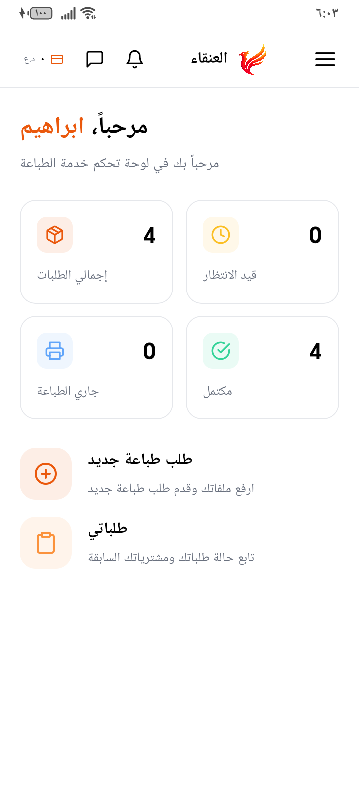
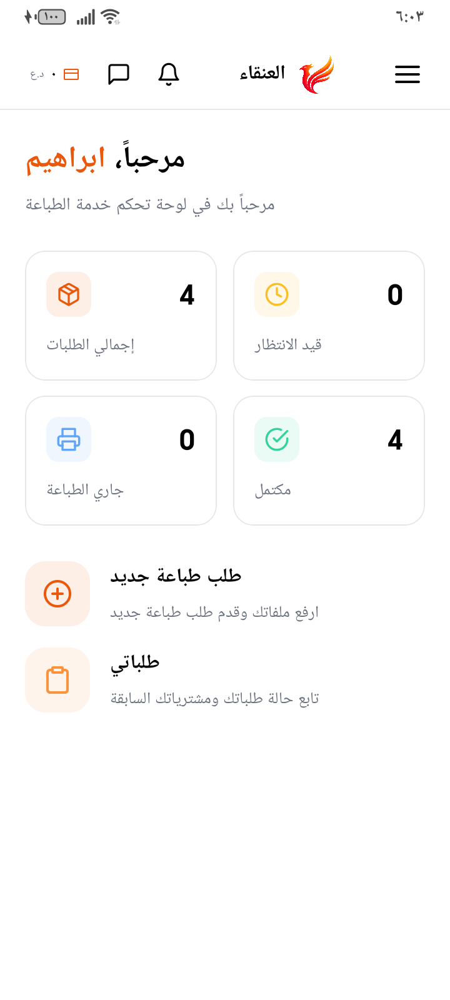
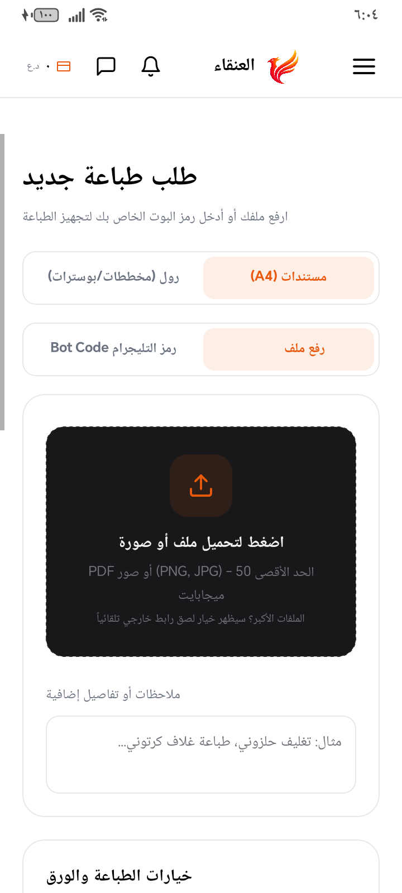
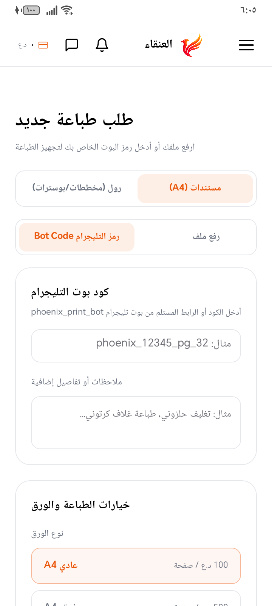
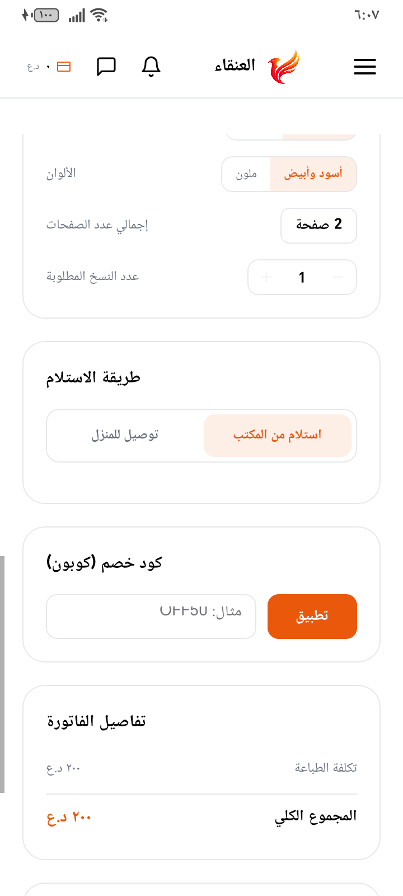

<div align="center">

# 🔥 Phoenix Print

### Modern Open-Source Mobile Printing Management Platform

Cross-platform mobile application built with **React Native**, **Expo**, **TypeScript**, and **Supabase** for modern print shop management.


---

*A complete mobile solution for managing print orders, file uploads, customer accounts, and print shop operations.*

</div>

---

# 📱 Screenshots

<p align="center">



</p>

<p align="center">



</p>

<p align="center">



</p>

<p align="center">

</p>

---

# ✨ Features

## Customer

- Secure Authentication
- Create Print Orders
- Upload PDF & Images
- Order Tracking
- Push Notifications
- Profile Management
- Multi-language Support
- Dark Mode

---

## Print Shop

- Admin Dashboard
- Order Management
- Customer Management
- File Preview
- Order Status Updates
- Notification System
- Real-time Synchronization

---

# 🛠 Tech Stack

| Technology | Usage |
|------------|-------|
| React Native | Mobile App |
| Expo | Development Framework |
| TypeScript | Programming Language |
| Supabase | Backend & Database |
| PostgreSQL | Database |
| Expo Router | Navigation |
| NativeWind | Styling |
| React Query | Data Fetching |

---

# 🏗 Architecture

```
Phoenix
│
├── App (React Native)
│
├── Authentication
│
├── Orders
│
├── File Upload
│
├── Notifications
│
├── Admin Dashboard
│
└── Supabase Backend
```

---

# 📂 Project Structure

```
app/
components/
hooks/
lib/
assets/
constants/
supabase/
types/
```

---

# 🚀 Getting Started

## Clone

```bash
git clone https://github.com/ibrahimyackop20-gif/phoenix.git
```

---

## Install

```bash
npm install
```

---

## Start

```bash
npx expo start
```

---

# ⚙ Environment Variables

Create a `.env` file.

```env
EXPO_PUBLIC_SUPABASE_URL=

EXPO_PUBLIC_SUPABASE_ANON_KEY=
```

---

# 📦 Build

Android

```bash
eas build --platform android
```

iOS

```bash
eas build --platform ios
```

---

# 🎯 Main Modules

- Authentication
- Print Orders
- File Upload
- Push Notifications
- Order Tracking
- Admin Dashboard
- User Profile
- Settings

---

# 🗺 Roadmap

- [x] Authentication
- [x] Order Management
- [x] File Upload
- [x] Push Notifications
- [x] Admin Dashboard
- [ ] Online Payments
- [ ] QR Order Pickup
- [ ] Multi-store Support
- [ ] Analytics Dashboard
- [ ] AI File Analysis

---

# 🤝 Contributing

Contributions are welcome.

If you'd like to improve Phoenix:

1. Fork the repository
2. Create your feature branch
3. Commit your changes
4. Push your branch
5. Open a Pull Request

---

# 📄 License

This project is licensed under the MIT License.

---

# 👨‍💻 Author

**Ibrahim Yackop**

Architecture Student • Mobile Developer

---

<div align="center">

### ⭐ If you like this project, consider giving it a Star.

Made with ❤️ using React Native & Supabase.

</div>