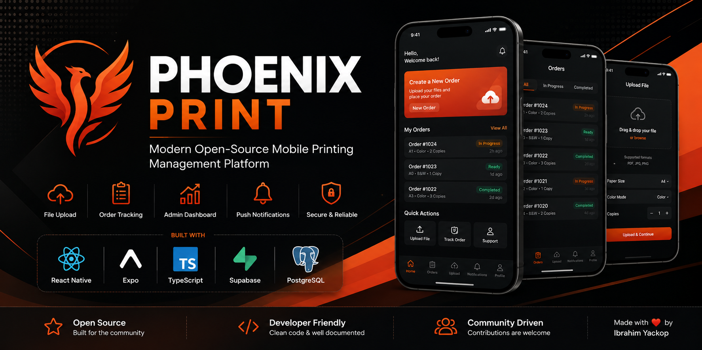
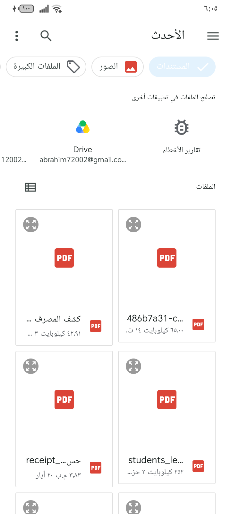
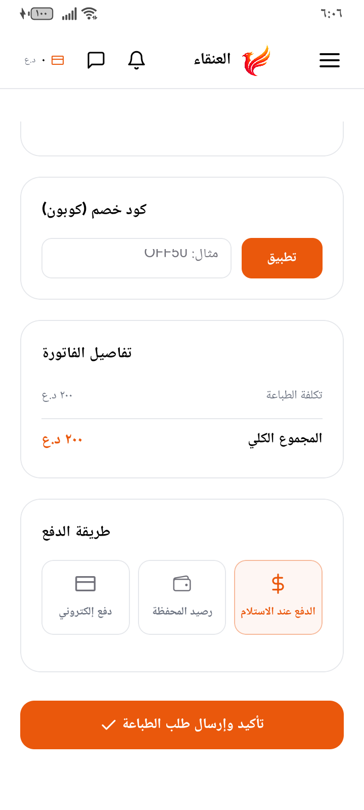
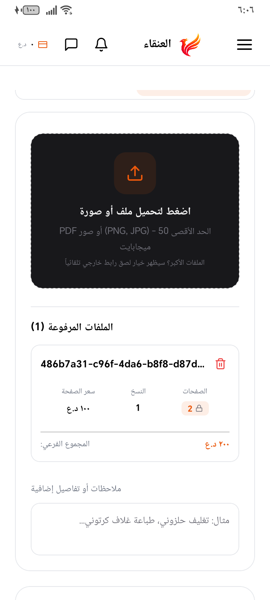

<div align="center">



# Phoenix Print

### Open-source print shop management for modern mobile teams

A production-ready **React Native + Expo** application for print shops and their customers — order intake, file uploads, real-time tracking, admin operations, and push notifications — backed by **Supabase**.

[](LICENSE)
[](https://expo.dev)
[](https://reactnative.dev)
[](https://www.typescriptlang.org)
[](https://supabase.com)
[](#building-android)
[](CONTRIBUTING.md)

[Features](#-features) · [Screenshots](#-screenshots) · [Architecture](#-architecture) · [Quick start](#-installation) · [Contributing](#-contributing)

</div>

---

## Table of contents

- [About](#about)
- [Features](#-features)
- [Screenshots](#-screenshots)
- [Architecture](#-architecture)
- [Tech stack](#-tech-stack)
- [Folder structure](#-folder-structure)
- [Installation](#-installation)
- [Environment variables](#-environment-variables)
- [Running locally](#-running-locally)
- [Building Android](#building-android)
- [Building iOS](#building-ios)
- [Roadmap](#-roadmap)
- [Contributing](#-contributing)
- [Security](#-security)
- [License](#-license)
- [Author](#-author)
- [Support the project](#-support-the-project)

---

## About

**Phoenix Print** (مطبعة العنقاء) is an open-source mobile platform for print shop workflows. Customers place print orders with document uploads; shop operators manage status, pricing, users, and notifications from an admin experience. The client is Expo Router + TypeScript; the backend is Supabase (Auth, Postgres, Storage, Realtime, Edge Functions).

This repository is intended for developers who want a complete, real-world reference for building multi-role mobile apps on Expo and Supabase — not a toy demo.

---

## ✨ Features

### Customers

- Email / OAuth authentication (Supabase Auth)
- Create and track print orders
- Upload PDFs and images for printing
- Order timeline, cancel flow, and PDF receipts
- Push notifications for status changes
- Profile, privacy, and account management
- Arabic / English i18n and light / dark / system themes

### Print shop (admin)

- Admin dashboard and order pipeline
- Customer and user management
- File preview and status updates
- Pricing, reports, and operational screens
- Real-time sync via Supabase Realtime
- Push notification tooling for operators

---

## 📱 Screenshots

<p align="center">
  
  
  
  
  
</p>

<p align="center">
  
  
  
  
  
</p>

---

## 🏗 Architecture

```text
┌─────────────────────────────────────────────────────────────┐
│                     Phoenix Print App                        │
│         Expo Router · React Native · TypeScript              │
├──────────────┬──────────────────────┬───────────────────────┤
│  Auth &      │  Orders · Uploads    │  Admin · Notifications│
│  Profile     │  Tracking · Receipts │  Pricing · Users      │
└──────┬───────┴──────────┬───────────┴───────────┬───────────┘
       │                  │                       │
       ▼                  ▼                       ▼
┌─────────────────────────────────────────────────────────────┐
│                         Supabase                             │
│  Auth · PostgreSQL · RLS · Storage · Realtime · Edge Fn      │
└─────────────────────────────────────────────────────────────┘
```

**Client:** Expo SDK 54 app under `src/` with shared UI in `components/` and domain helpers in `lib/`.  
**Backend:** SQL migrations and Edge Functions under `supabase/`.  
**CI:** GitHub Actions builds Android preview APKs and Play-ready release AABs (unique `versionCode` per run).

---

## 🛠 Tech stack

| Layer | Technology |
|-------|------------|
| Mobile | React Native 0.81, Expo SDK 54, Expo Router |
| Language | TypeScript |
| Styling | NativeWind (Tailwind CSS) |
| Backend | Supabase (Auth, Postgres, Storage, Realtime) |
| Server logic | Supabase Edge Functions (Deno) |
| i18n | i18next / react-i18next |
| CI | GitHub Actions (Android APK / AAB) |
| Optional cloud builds | EAS Build |

---

## 📂 Folder structure

```text
phoenix-print-app/
├── src/                    # App routes, screens, hooks, theme
│   ├── app/                # Expo Router file-based routes
│   ├── components/         # Screen-level / feature UI
│   ├── hooks/
│   ├── theme/
│   └── constants/
├── components/             # Shared app components & providers
├── lib/                    # API helpers, Supabase client, utilities
├── assets/                 # Icons, splash, images
├── supabase/
│   ├── migrations/         # Postgres schema & RLS
│   ├── functions/          # Edge Functions
│   └── secrets.example     # Server secret names (no values)
├── scripts/                # CI / maintenance scripts
├── docs/
│   ├── banner.png          # README hero banner
│   └── screenshots/        # Product screenshots (t1–t10)
├── .github/
│   ├── workflows/          # Android preview & release builds
│   └── ISSUE_TEMPLATE/     # Bug / feature templates
├── app.config.js           # Expo config (env → extra, versionCode, FCM file)
├── app.json                # Expo static config
├── .env.example            # Client env template
├── google-services.json.example  # Firebase Android template (real file gitignored)
└── package.json
```

---

## 🚀 Installation

### Prerequisites

- Node.js 20+ (LTS recommended)
- npm 10+
- Expo CLI (via `npx`)
- For device builds: Android Studio and/or Xcode
- A Supabase project (Auth, Database, Storage)

### Clone

```bash
git clone https://github.com/ibrahimyackop20-gif/phoenix.git
cd phoenix
```

> If your local folder is named `phoenix-print-app`, `cd` into that directory instead.

### Install dependencies

```bash
npm ci
# or: npm install
```

---

## ⚙ Environment variables

Copy the example file and fill in your Supabase project values:

```bash
cp .env.example .env
```

| Variable | Required | Description |
|----------|----------|-------------|
| `EXPO_PUBLIC_SUPABASE_URL` | Yes | Primary Supabase project URL |
| `EXPO_PUBLIC_SUPABASE_ANON_KEY` | Yes | Primary anon (publishable) key |
| `EXPO_PUBLIC_CENTRAL_SUPABASE_URL` | Yes | Central / shared Supabase URL |
| `EXPO_PUBLIC_CENTRAL_SUPABASE_ANON_KEY` | Yes | Central anon key |
| `EXPO_PUBLIC_WEB_URL` | Optional | Companion web app base URL |

**Never commit `.env`.** Only `EXPO_PUBLIC_*` values belong in the mobile client. Server secrets (service role, Telegram bot tokens, etc.) stay in Supabase / CI secrets — see `supabase/secrets.example`.

For Google Sign-In, configure the Google provider and redirect URLs in the Supabase dashboard (details in `.env.example`).

### Firebase / Android push (`google-services.json`)

Android FCM needs a project-specific `google-services.json`. **It is not committed** (see `google-services.json.example`).

```bash
# After downloading from Firebase Console → Project settings → Your apps
cp google-services.json.example google-services.json
# Then replace the contents with your real Firebase Android config
```

`app.config.js` only sets `android.googleServicesFile` when that file exists, so Expo prebuild still works without it (push notifications will be unavailable until you add a real file).

For GitHub Actions, add secret `GOOGLE_SERVICES_JSON_BASE64` (base64 of your real `google-services.json`). If the secret is missing, CI copies the example so the APK/AAB build still succeeds.

---

## 🖥 Running locally

```bash
npx expo start
```

Then press `a` for Android emulator, `i` for iOS simulator, or scan the QR code with a development build.

Native modules (notifications, some auth flows) work best with a **dev client** or local native build:

```bash
npx expo run:android
npx expo run:ios
```

Lint:

```bash
npm run lint
```

---

## Building Android

### GitHub Actions (recommended for this repo)

1. Open **Actions** → **Android Release** (or **Android Preview** for an internal APK).
2. Run **workflow_dispatch**.
3. Download the artifact (AAB / APK).

Release builds compute a unique Play Store `versionCode` as `1000 + github.run_number` so each upload is accepted by Google Play.

Required repository secrets / variables for a working release:

- `EXPO_PUBLIC_SUPABASE_URL`, `EXPO_PUBLIC_SUPABASE_ANON_KEY`
- `EXPO_PUBLIC_CENTRAL_SUPABASE_URL`, `EXPO_PUBLIC_CENTRAL_SUPABASE_ANON_KEY`
- Optional FCM: `GOOGLE_SERVICES_JSON_BASE64` (base64 of `google-services.json`)
- Optional signing: `ANDROID_KEYSTORE_BASE64`, `ANDROID_KEYSTORE_PASSWORD`, `ANDROID_KEY_ALIAS`, `ANDROID_KEY_PASSWORD`

### EAS (optional)

```bash
npx eas-cli build --platform android --profile production
```

### Local Gradle (after prebuild)

```bash
npx expo prebuild --platform android
cd android && ./gradlew :app:bundleRelease
```

---

## Building iOS

### EAS

```bash
npx eas-cli build --platform ios --profile production
```

### Local (macOS + Xcode)

```bash
npx expo prebuild --platform ios
npx expo run:ios --configuration Release
```

Configure signing in Xcode / Apple Developer before App Store submission. Bundle identifier: `com.phoenix.printing`.

---

## 🗺 Roadmap

- [x] Authentication and profiles
- [x] Print order lifecycle
- [x] File upload and storage
- [x] Push notifications
- [x] Admin dashboard
- [x] Order cancel + PDF receipts
- [x] CI Android preview / release builds
- [ ] Online payments
- [ ] QR order pickup
- [ ] Multi-store support
- [ ] Analytics dashboard
- [ ] AI-assisted file analysis

Suggestions welcome via [GitHub Issues](https://github.com/ibrahimyackop20-gif/phoenix/issues).

---

## 🤝 Contributing

Contributions of all sizes are welcome — bug fixes, docs, translations, and features.

Please read:

- [CONTRIBUTING.md](CONTRIBUTING.md) — how to propose changes
- [CODE_OF_CONDUCT.md](CODE_OF_CONDUCT.md) — community standards
- [SECURITY.md](SECURITY.md) — vulnerability reporting

Quick path:

1. Fork the repository  
2. Create a branch: `git checkout -b feature/your-change`  
3. Commit with [Conventional Commits](https://www.conventionalcommits.org/)  
4. Open a pull request using the PR template  

---

## 🔒 Security

Do not open public issues for sensitive vulnerabilities. See [SECURITY.md](SECURITY.md).

---

## 📄 License

This project is licensed under the [MIT License](LICENSE).

Copyright (c) 2026 Ibrahim Yackop.

---

## 👨‍💻 Author

**Ibrahim Yackop**  
Architecture student · Mobile developer  

- GitHub: [@ibrahimyackop20-gif](https://github.com/ibrahimyackop20-gif)

---

## ⭐ Support the project

If Phoenix Print helps you learn, teach, or ship a print shop product:

1. **Star** the repository on GitHub  
2. Share it with other mobile / Supabase developers  
3. Open issues and pull requests  

<div align="center">

### Thanks for checking out Phoenix Print

Built with React Native, Expo, and Supabase.

[⬆ Back to top](#phoenix-print)

</div>
